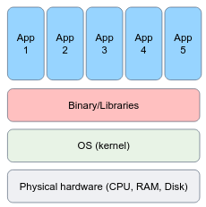
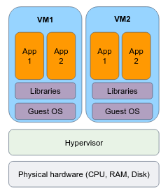
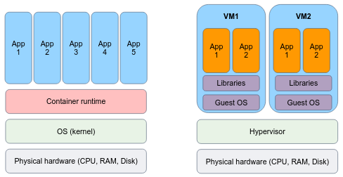
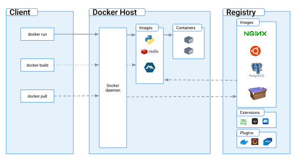

# Docker Intro

## Intro to virtualization

### Bare metal systems

In the pre-virtualization era, applications were typically executed directly on the OS system, often referred to as "bare metal".
You are likely already familiar with this concept as it is what you do when you install and run programs on your personal computer or laptop.
There is no "virtualized" layer, everything is running in the same environment. 



Bare metal systems involve installing and running the operating system, binaries/libraries, and applications directly on the physical hardware.
While it provides direct hardware access and customization options, it can lead significant challenges in production systems:

- **Dependency Conflicts**: Bare metal systems can suffer from complex dependency conflicts, making it challenging to manage software libraries and versions, leading to compatibility issues.
- **Resource Underutilization**: Since applications run directly on the physical hardware, resource utilization can be inefficient, as each application may require dedicated hardware resources even when they are not fully utilized.
- **Limited Scalability**: Scaling a bare metal system involves physically provisioning and configuring new hardware, which can be time-consuming and costly compared to more flexible virtualized or containerized environments.
- **Lack of Flexibility**: Bare metal systems lack the flexibility to quickly switch between different operating systems or runtime environments, restricting experimentation and limiting the adoption of different technologies.
- **High Maintenance Overhead**: Managing and maintaining bare metal systems typically requires manual configuration, patching, and updates for both the hardware and software components, resulting in higher administrative overhead.
- **Long Deployment Times**: Provisioning and decommissioning bare metal servers can be a time-intensive process, involving physical setup, installation, and configuration, leading to slower deployment cycles.
- **Limited Fault Isolation**: Failures or issues in one application or component of a bare metal system can have a wide-ranging impact on other applications or services running on the same hardware, potentially leading to system-wide disruptions.
- **Higher Costs**: Bare metal systems often require significant upfront capital investment for hardware infrastructure, and the cost of maintaining and upgrading hardware can be expensive compared to more agile and scalable alternatives.

### Virtual machines

Virtual machines (VMs) are an abstraction layer that enables the creation and operation of multiple isolated instances of virtual hardware within a single physical host. 
This is made possible through a software component called a **hypervisor** or "virtual machine monitor" (VMM), which partitions the host resources and allows each VM to have its own virtualized hardware configuration, including an operating system, binaries/libraries, and applications.
VMs provide a way to consolidate multiple independent environments on a single physical server, offering flexibility, isolation, and the ability to run different operating systems and software stacks concurrently.



VMs offer several advantages:

- **Isolation**: VMs provide strong isolation between different instances running on the same physical host. Each VM operates in its own virtual environment, ensuring that applications and processes within one VM do not interfere with others, providing enhanced security and stability.
- **Hardware Abstraction**: VMs abstract the underlying physical hardware, allowing applications to run on virtualized hardware configurations. This enables greater flexibility in deploying applications, as VMs can be provisioned with specific resources such as CPU, memory, and storage tailored to the application's requirements.
- **Operating System Flexibility**: VMs allow for the simultaneous execution of multiple operating systems on a single physical host. This flexibility is valuable when running applications that have dependencies on different operating systems or when testing software compatibility across various OS environments.
- **Resource Optimization**: VMs enable efficient utilization of hardware resources. Multiple VMs can run on a single physical host, effectively consolidating workloads and optimizing resource allocation. This can lead to higher overall resource utilization and cost savings by maximizing the use of available hardware.
- **Snapshotting and Rollbacks**: VMs often support snapshotting, allowing you to capture the entire state of a VM at a specific point in time. This feature is useful for creating backups, performing software testing, or quickly rolling back to a previous state in case of issues or failures.
- **Scalability and Elasticity**: VMs can be easily cloned or duplicated to scale up or down the infrastructure based on demand. It simplifies the process of adding or removing VM instances to meet changing workload requirements, providing scalability and elasticity to adapt to dynamic environments.
- **Migration and High Availability**: VMs can be migrated or live-migrated from one physical host to another without significant service interruptions. This feature allows for load balancing, system maintenance, and improved high availability by seamlessly transferring VMs between hosts without disrupting the running applications.
- **Testing and Development Environments**: VMs are widely used for creating isolated testing and development environments. Developers can have dedicated VMs to test software configurations, simulate different network setups, and experiment with new applications without affecting the production environment.

A cluster of physical hardware can support the operation of thousands of virtual machines (VMs), enabling efficient resource utilization, scalability, and to recover from failure in minutes.


### Containers 

Containers offer a similar level of isolation for installing and configuring binaries/libraries as virtual machines, but they differ in their approach.
Instead of virtualizing at the hardware layer, containers utilize native Linux features like **cgroups** and **namespaces** to provide isolation while sharing the same kernel. 
This lightweight approach allows for faster startup times, improved resource efficiency, and easier scalability compared to traditional virtual machines.




Containers are an abstraction at the app layer that packages code and dependencies together. Multiple containers can run on the same machine and share the OS kernel with other containers, each running as isolated processes in user space. Containers take up less space than VMs (container images are typically tens of MBs in size), can handle more applications and require fewer VMs and Operating systems.

Virtual machines (VMs) are an abstraction of physical hardware turning one server into many servers. The hypervisor allows multiple VMs to run on a single machine. Each VM includes a full copy of an operating system, the application, necessary binaries and libraries – taking up tens of GBs. VMs can also be slow to boot.

The technology of containers plays an important role in modern software development and deployment, for several reasons:

- **Lightweight and Portable**: Containers provide a lightweight and portable way to package applications and their dependencies. They encapsulate an application and its runtime environment, including libraries and dependencies, into a single container image that can be run consistently across different environments and infrastructure. You build an image **once**, and can run it as containers **everywhere**.
- **Isolation and Resource Efficiency**: Containers offer process-level isolation, ensuring that each application runs in its own isolated environment. This isolation provides enhanced security and eliminates conflicts between applications. Containers also enable efficient utilization of system resources by sharing the host operating system kernel and avoiding the overhead of running a full virtual machine for each application.
- **Consistent and Reproducible Builds**: Containers enable consistent and reproducible builds by capturing the entire application stack, including dependencies and configurations, in a container image. This image can be versioned and shared, ensuring that the application can be built and deployed in the same way across different environments, making it easier to manage and deploy applications consistently.
- **Scalability and Elasticity**: Containers facilitate scalability and elasticity by allowing applications to be deployed and managed in a distributed and orchestrated manner. Container orchestration platforms like Kubernetes enable automatic scaling, load balancing, and high availability of containerized applications, making it easier to handle varying workloads and ensure application availability.
- **DevOps and Continuous Integration/Deployment (CI/CD)**: Containers align well with DevOps principles and enable streamlined CI/CD workflows. Containers provide a consistent environment for development, testing, and production, making it easier to package and deploy applications across different stages of the software development lifecycle. Containers can be integrated with CI/CD pipelines to automate the build, test, and deployment processes, improving development velocity and agility.

## Containers terminology

A "container image" (or shortly, **image**) is a lightweight, standalone, executable package of software that includes everything needed to run an application: code, runtime, system tools, system libraries and settings.
You can transfer images from one machine to the other. Every machine is able to "run the image" without the need to install the application dependencies, define environment variables and networking settings.

A **container** is a single running instance of an image. You can create, start, stop, move, or delete a container, and they can be run easily and reliably from one computing environment to another.
The computer that runs the container is frequently referred to as a **host machine**, because it "hosts" containers.

By default, a container is relatively well isolated from other containers and its host machine. You can control how isolated a container's network, storage, or other underlying subsystems are from other containers or from the host machine.

A container, as we mentioned, is defined by its image as well as any configuration options you provide to it when you create or start it.
When a container is removed, any changes to its state that are not stored in persistent storage disappear.

## Containers under the hoods

Under the hoods, containers are merely a **linux process**. 

But they are unique processes that "live" in an isolated environment. By this means, the process "believes" that he is the only process in the system, he is **containerized**. 
Containers are a technology that leverages the Linux kernel's features to provide lightweight and isolated environments for running applications. 

Linux containers utilize several key components:

- **Namespaces**: Linux namespaces provide process-level isolation by creating separate instances of various resources, such as the process ID namespace, network namespace, mount namespace, and more. Each container has its own isolated namespace, allowing processes within the container to have their own view of system resources.
- **Control Groups (cgroups)**: Control groups, or cgroups, enable resource management and allocation by imposing limits, prioritization, and accounting on system resources such as CPU, memory, disk I/O, and network bandwidth. Cgroups ensure that containers do not exceed their allocated resources and provide fine-grained control over resource utilization.

## Docker architecture

**Docker** is an open platform for developing, building and shipping images, and running containers.

Docker container technology was launched in 2013 as an open source [Docker Engine](https://www.docker.com/products/container-runtime/).

Docker uses a client-server architecture. The Docker client talks to the Docker daemon, which does the heavy lifting of building, running, and distributing your Docker containers. The Docker client and daemon can run on the same system, or you can connect a Docker client to a remote Docker daemon. The Docker client and daemon communicate using a REST API, over UNIX sockets or a network interface. Another Docker client is Docker Compose, which lets you work with applications consisting of a set of containers.



- The Docker daemon (`dockerd`) listens for Docker API requests and manages Docker objects such as images, containers, networks, and volumes.
- The Docker client (`docker`) is the primary way that many Docker users interact with Docker. When you use commands such as docker run, the client sends these commands to dockerd, which carries them out.
- A Docker registry stores Docker images. [Docker Hub](https://hub.docker.com/) is a public registry that anyone can use, and Docker is configured to look for images on Docker Hub by default. You will even run your own private registry later on in the course.

### Docker installation and configuration

Please [install Docker](https://docs.docker.com/engine/install/ubuntu/) if you haven't done it before.

**Tip**: you can add your user to the `docker` group, so you could use the `docker` command without `sudo`:

```bash 
sudo usermod -aG docker $USER
```

Upon up and running `docker` installation, the `docker version` command output may look like: 

```text
Client: Docker Engine - Community
 Version:           20.10.22
 API version:       1.41
 Go version:        go1.18.9
 Git commit:        3a2c30b
 Built:             Thu Dec 15 22:28:02 2022
 OS/Arch:           linux/amd64
 Context:           default
 Experimental:      true

Server: Docker Engine - Community
 Engine:
  Version:          20.10.22
  API version:      1.41 (minimum version 1.12)
  Go version:       go1.18.9
  Git commit:       42c8b31
  Built:            Thu Dec 15 22:25:51 2022
  OS/Arch:          linux/amd64
  Experimental:     false
 containerd:
  Version:          1.6.14
  GitCommit:        9ba4b250366a5ddde94bb7c9d1def331423aa323
 runc:
  Version:          1.1.4
  GitCommit:        v1.1.4-0-g5fd4c4d
 docker-init:
  Version:          0.19.0
  GitCommit:        de40ad0
```

Note that docker is running as a service on your system, hence can be controlled by `systemctl`:

```bash
$ sudo systemctl status docker
● docker.service - Docker Application Container Engine
     Loaded: loaded (/lib/systemd/system/docker.service; disabled; vendor preset: enabled)
     Active: active (running) since Sun 2023-05-07 09:56:45 IDT; 5min ago
TriggeredBy: ● docker.socket
       Docs: https://docs.docker.com
   Main PID: 261600 (dockerd)
      Tasks: 123
     Memory: 209.5M
     CGroup: /system.slice/docker.service
             └─261600 /usr/bin/dockerd -H fd:// --containerd=/run/containerd/containerd.sock

May 07 09:56:39 hostname dockerd[261600]: time="2023-05-07T09:56:39.509330916+03:00" level=warning msg="Your kernel does not support CPU realtime scheduler"
May 07 09:56:39 hostname dockerd[261600]: time="2023-05-07T09:56:39.509350949+03:00" level=warning msg="Your kernel does not support cgroup blkio weight"
May 07 09:56:39 hostname dockerd[261600]: time="2023-05-07T09:56:39.509365744+03:00" level=warning msg="Your kernel does not support cgroup blkio weight_device"
May 07 09:56:39 hostname dockerd[261600]: time="2023-05-07T09:56:39.533460844+03:00" level=info msg="Loading containers: start."
May 07 09:56:42 hostname dockerd[261600]: time="2023-05-07T09:56:42.942065068+03:00" level=info msg="Default bridge (docker0) is assigned with an IP address 172.17.0.0/16. Daemon option --bip can be used to set a preferred IP address"
May 07 09:56:43 hostname dockerd[261600]: time="2023-05-07T09:56:43.248511892+03:00" level=info msg="Loading containers: done."
May 07 09:56:44 hostname dockerd[261600]: time="2023-05-07T09:56:44.943477277+03:00" level=info msg="Docker daemon" commit=42c8b31 graphdriver(s)=overlay2 version=20.10.22
May 07 09:56:44 hostname dockerd[261600]: time="2023-05-07T09:56:44.972157071+03:00" level=info msg="Daemon has completed initialization"
May 07 09:56:45 hostname dockerd[261600]: time="2023-05-07T09:56:45.533037228+03:00" level=info msg="API listen on /var/run/docker.sock"
May 07 09:56:45 hostname systemd[1]: Started Docker Application Container Engine.
``` 

From docker's service status output we can learn a few important properties of the docker client and daemon. 

When the Docker client (`docker`) and daemon (`dockerd`) are on the same machine (usually the case), 
they communicate using a UNIX socket located in `/var/run/docker.socket`, typically via RESTful API endpoints.

When the client and daemon are not on the same machine, they communicate over the internet via HTTPS protocol.

What else can we learn about the docker daemon? that it does not run containers itself! Docker relies on the `containerd` service to manage containers lifecycle.
Containerd is an open-source container runtime that provides a **high-level interface** for managing container lifecycle and execution. It is serving as the underlying runtime for various container platforms, including Docker.
Containerd, in turn, uses `runc` as the default OCI-compliant runtime for actually running containers. Containerd utilizes runc to execute the container processes, manage resource isolation, and handle **low-level interface** container operations according to the OCI specification.

To summarize, containers are not exclusive to Docker, they are a broader technology and concept that existed before Docker's popularity. 
Docker popularized and simplified the adoption of containers by providing a user-friendly interface and tooling, but there are alternative container runtimes and platforms available, such as Podman, that leverage containers for application deployment and management.

Under the hood, `runc` does the dirty job of running containers: 


<br>
<a href="https://mkdev.me/posts/the-tool-that-really-runs-your-containers-deep-dive-into-runc-and-oci-specifications">Image source: https://mkdev.me/posts/the-tool-that-really-runs-your-containers-deep-dive-into-runc-and-oci-specifications</a>

In a moment, you'll run you first container, this is the execution order of the different components that responsible for the container execution: 


## Hello world example 

The Docker "Hello World" container is a simple and lightweight container that is often used to verify if Docker is properly installed and functioning on a system. It is based on the official Docker image called [hello-world](https://hub.docker.com/_/hello-world).

```bash
docker run hello-world
```

The hello-world image is an example of minimal containerization with Docker.
It has a single `hello.c` file responsible for printing out the message you're seeing on your terminal.

# Self-check questions

[Enter the interactive self-check page](https://alonitac.github.io/UPES-CSDV3004/multichoice-questions/docker_intro.html)


# Exercises

## Optional practice

### Remote docker daemon

As you may know, Docker is designed in client-server architecture, where both sides are not necessarily running on the same machine.
Your goal is to run the docker daemon (the server) of a different machine, and communicate with it from your local machine.

Feel free to find useful tutorials either in Docker's official docs or any other resource.
You can use some EC2 instances as the remote machine.
